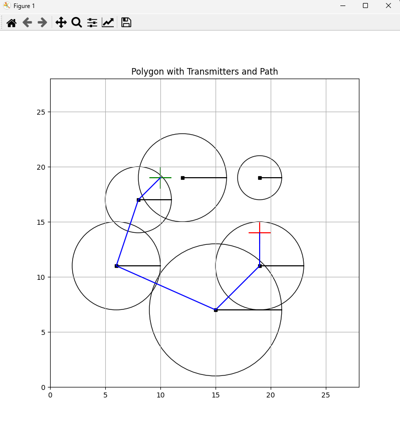
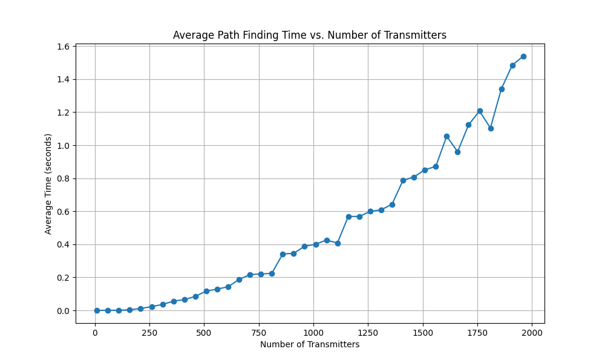

# PathFinder - Finding Paths in the Presence of Transmitters

## Overview

The PathFinder is a Python class designed for finding paths between points in an
environment that contains transmitters. This class is particularly useful for scenarios where
you need to determine if a path between two points is possible while considering the
presence of transmitters that might obstruct the path.

The primary functionality of the module is to assess the feasibility of a path between two
points in an environment with transmitters. It employs a breadth-first search (BFS) approach
to explore potential paths, taking transmitters into account. It returns a boolean result to
indicate whether a path is possible, along with the list of transmitters representing the path if
one exists.

## Installation

The recommended way to install the PathFinder module is to use pip.
Navigate to the directory containing the module's source code and run the following command:

```bash
pip install .
```

If you get

```
ImportError: No module named _tkinter, please install the python-tk package
```

then install `tkinter`: `apt-get install python3-tk`.

For Windows users:

If you get

```
ModuleNotFoundError: No module named '_curses'
```

then install `windows-curses`: `pip install windows-curses`.

## Usage

1. Run the CLI script `find_path`, providing input for the number of transmitters,
   their coordinates, power, and the start and end points.
2. The script will use the `PathFinder` class to determine if a safe path exists between the
   specified points while considering the transmitters.
3. It will provide feedback on whether a safe path is possible,
   along with optional visual representation if a path exists.

|  |
|:--------------------------:|
|        CLI output.         |

|                        |
|:----------------------------------------------------:|
| Polygon with Transmitter and Path generated by code. |

# The Quadrocopter Path Finder app

## Application Overview

The Quadrocopter Path Finder app is designed to help you plan safe flight paths for
quadrocopters by avoiding obstacles.
The app allows you to add transmitters, set start and end points, check the flight path's
safety, and reset data when needed.

## Run the application

After installing module, run `find_path_gui`.

## User Interface

The app's user interface consists of the following elements:

* Canvas: Use the canvas to interact with the map and add transmitters, start and end points.
* Result Box: Displays messages and results.
* Buttons: Control various app functions.

## Using the App

### Adding Transmitters

To add a transmitter:

1. Click the "Add Transmitter" button.
2. Click on the canvas to specify the transmitter's location and radius. Drag the cursor to adjust the radius.

### Setting Start and End Points

To set the start and end points:

1. Click the "Set Start Point" button.
2. Click on the canvas to set the start point's location.
3. Click the "Set End Point" button.
4. Click on the canvas to set the end point's location.

### Checking the Flight Path

To check the flight path's safety:

1. Click the "Check Path" button.
2. The app will analyze the path and display the results in the Result Box.

### Resetting Data

To reset all data and start over:

1. Click the "Reset Data" button.
2. All data will be cleared, and the canvas will be reset to its initial state.

|                          |
|:------------------------------------------------------:|
| Application main view with the Path generated by code. |

## Performance Evaluation

### Procedure

Used script: [time_measure.py](quadrocopter/utils/time_measure.py).

1. Environment Simulation:
    * Random environments were generated, each with a different number of transmitters, start and end points.

2. Time Measurement:
    * The script recorded the execution time required to determine if a safe flight path existed in each scenario.
    * Multiple iterations (100) were performed for each transmitter count to ensure reliable measurements.

3. Data Analysis:
    * The recorded execution times were averaged for each transmitter count.
    * These average times represented the efficiency of the pathfinding algorithm in various environmental complexities.

4. Visualization:
    * The results were visualized in a plot, with the number of transmitters on the x-axis and the average execution
      time on the y-axis.
    * The plot provided a clear representation of how the pathfinding performance scaled with increasing transmitter
      count.

|  |
|:--------------------------------------------:|
|            Time measure results.             |